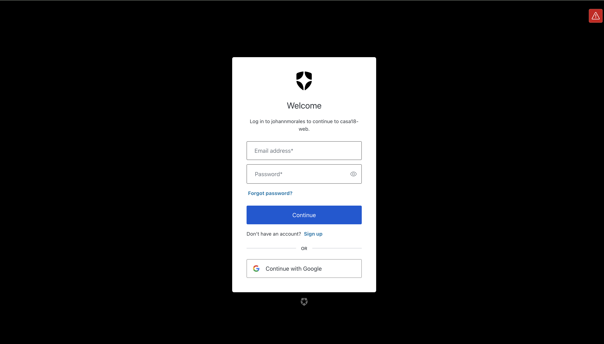

## running

run with docker

set AUTH0_BASE_URL=http://localhost:3000
in web .env

```sh
docker compose -f docker-compose-prod.yml up -d --build
```

env files in source control for simplicity, in a real scenario we would need to ignore them and create our own auth0 app

login with auth0 => google preferibly

## deployed at

- Currently not deployed as local dynamo instance was failing in virtual machine, I didnt want to use a real dynamo db instance because of cost. We can run the project simply by running it with docker

## next steps

- Add testing using react testing library and jest
- Include operations (currently mock data can be added by calling /proxy/mock)
- use production build instead of development mode
- add catch all route and error route to frontend

## production

- create a docker registry for backend and frontend images
- run instances using the images in the docker regsitry
- add a github actions script to update images on each push to master (move development to other branch)

### Dashboard


### Deals


### login


